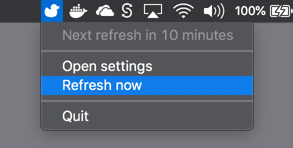
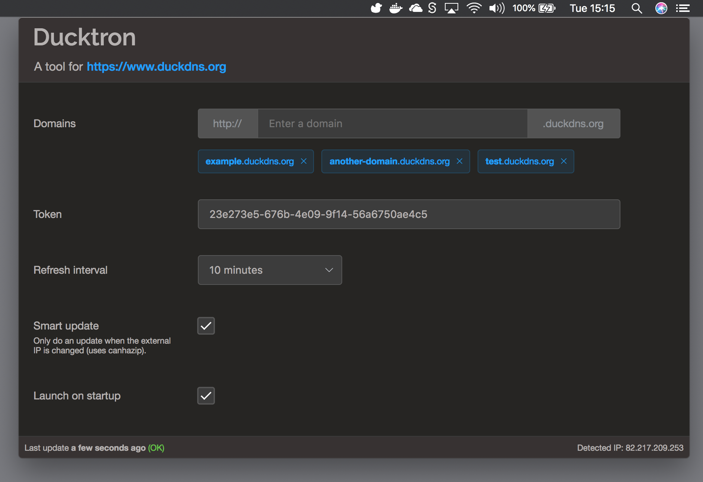

[](https://travis-ci.org/Aanhane/ducktron)
[](https://ci.appveyor.com/project/Aanhane/ducktron)

# Ducktron

A cross-platform update client for www.duckdns.org, based on Electron and Vue.

It will show tray-icon from which you can configure the application and do a manual update.


In the settings you can configure the obvious stuff.


#### Build Setup

``` bash
# install dependencies
npm install

# serve with hot reload at localhost:9080
npm run dev

# build electron application for production
npm run build

# run unit & end-to-end tests
npm test
```
---

This project was generated with [electron-vue](https://github.com/SimulatedGREG/electron-vue)@[cf53551](https://github.com/SimulatedGREG/electron-vue/tree/cf53551a209b49220525e7de80f1c541d7096aef) using [vue-cli](https://github.com/vuejs/vue-cli). Documentation about the original structure can be found [here](https://simulatedgreg.gitbooks.io/electron-vue/content/index.html).
